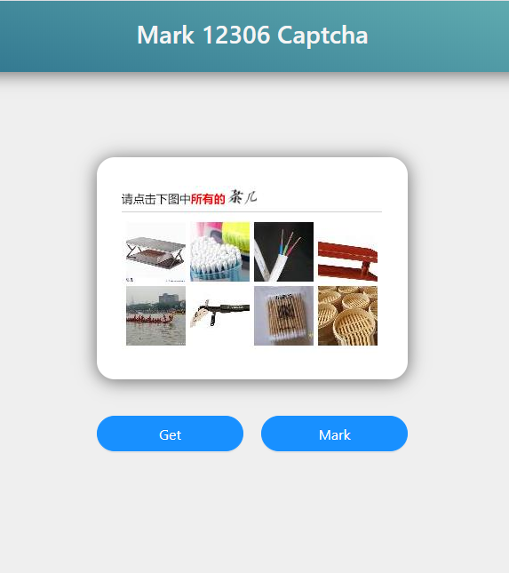
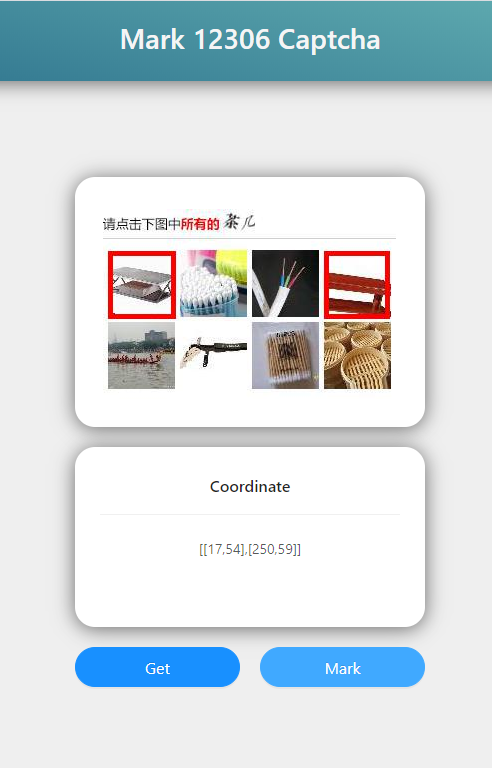

# Mark 12306 Captcha Platform
## 技术栈
- RestfulAPI 基于Flask
- Tensorflow
- Keras
- 前端 React

## 说明
项目基于Tensorflow版本2.1.0和Keras2.3.1构建，该Keras版本在配合Flask的时候会发生thread.local错误。需要用/resource目录下的文件进行替换，或者可以手动更改tensorflow_backend.py文件。

**更改**
```
    @functools.wraps(func)
    def symbolic_fn_wrapper(*args, **kwargs):
        if _SYMBOLIC_SCOPE.value:
            with get_graph().as_default():
                return func(*args, **kwargs)
        else:
            return func(*args, **kwargs)
    return symbolic_fn_wrapper
```
**为**
```
    @functools.wraps(func)
    def symbolic_fn_wrapper(*args, **kwargs):
        _SYMBOLIC_SCOPE.value = True
        if _SYMBOLIC_SCOPE.value:
            with get_graph().as_default():
                return func(*args, **kwargs)
        else:
            return func(*args, **kwargs)
    return symbolic_fn_wrapper
```
## 运行结果



## 使用 Docker 部署

下载镜像
```bash
docker pull wudinaonao/flask-mark-12306-captcha
```

启动容器
 - docker
    ```bash
    docker run -dit -p 8848:8848 wudinaonao/flask-mark-12306-captcha
    ```
 - docker compose
    ```bash
    version: "3.1"
    services:
      flask-mark-12306-captcha:
        image: wudinaonao/flask-mark-12306-captcha
        container_name: flask-mark-12306-captcha
        ports:
          - 8848:8848
        restart: always
    ```
